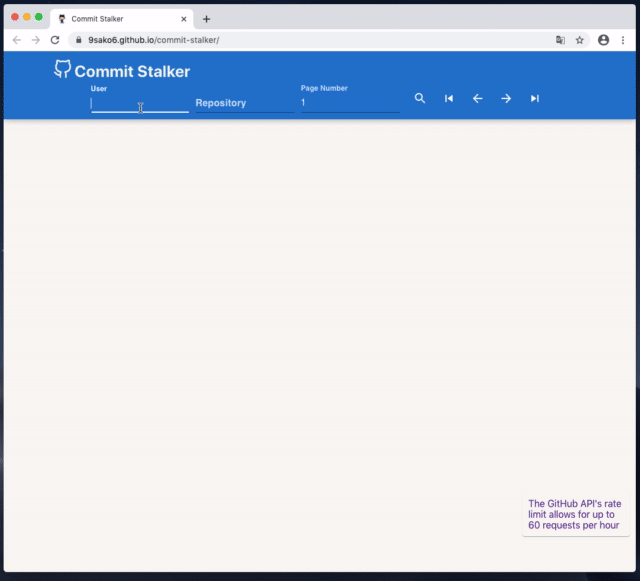

# commit-stalker

GitHub commits viewer.
**100 commits** are showed in a page. (35 commits in the official site.)
In addition, you can search **the oldest commit** easily.
URL: https://9sako6.github.io/commit-stalker/

# More Details
[I built the Web app to search commits on GitHub - dev.to](https://dev.to/9sako6/i-built-the-web-app-to-search-commits-on-github-3l82)

[2019-05-06]
To count all commit, commit-stalker uses original Web API: [9sako6/github-api-for-commit-count](https://github.com/9sako6/github-api-for-commit-count)