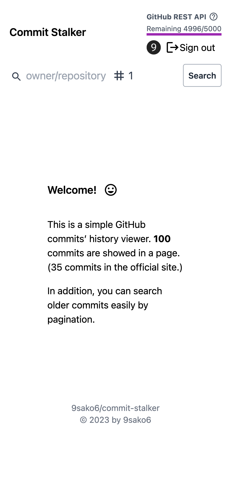
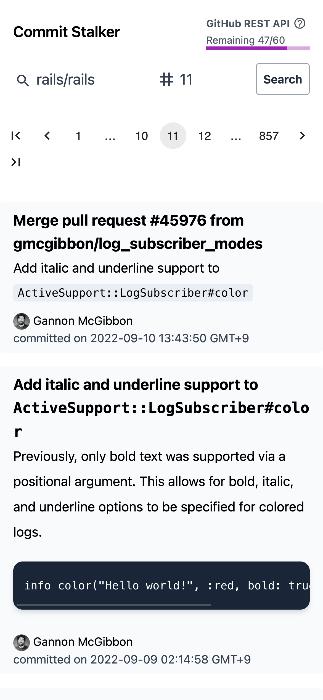

# commit-stalker

This is a simple GitHub commits' history viewer.
**100 commits** are showed in a page. (35 commits in the official site.)
In addition, you can search older commits easily by pagination.

URL: https://9sako6.github.io/commit-stalker/

https://user-images.githubusercontent.com/31821663/210141602-b640a7a4-7377-4e40-83f2-96f8427d02f4.mov

These are sample screenshots on mobile.

  
  

## 🌐 App URL

https://9sako6.github.io/commit-stalker/

## More Details

[I built the Web app to search commits on GitHub - dev.to](https://dev.to/9sako6/i-built-the-web-app-to-search-commits-on-github-3l82)

## Change log

- [2022-12-31] Replace with Next.js
- [2020-04-29] responsive support
- [2019-05-06] To count all commit, commit-stalker uses original Web API:
  [9sako6/github-api-for-commit-count](https://github.com/9sako6/github-api-for-commit-count)
  - [2021-08-19] This API is no longer used.

## License

- [WTFPL](https://github.com/9sako6/commit-stalker/blob/master/LICENSE.md)
