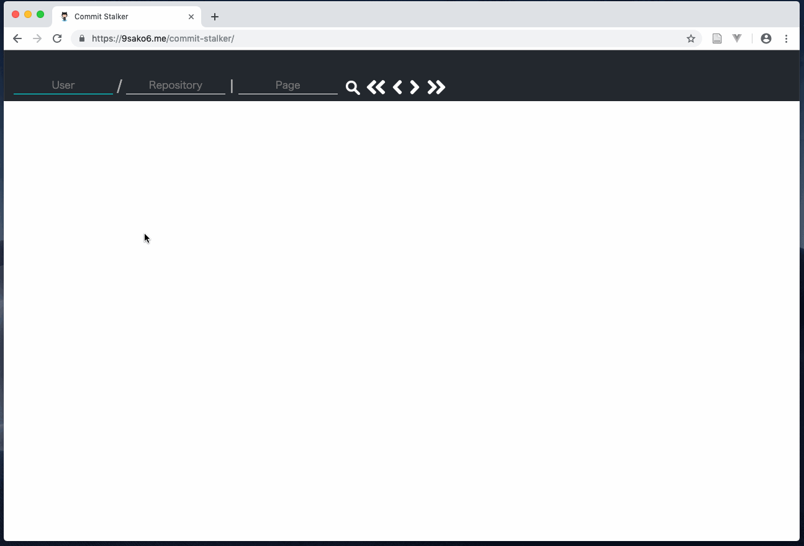

# commit-stalker

GitHub commits viewer.
**100 commits** are showed in a page. (30 commits in the official site.)

In addition, You can search **the oldest commit** easily.

~~URL: https://commit-stalker.firebaseapp.com/~~

URL: https://9sako6.me/commit-stalker/
